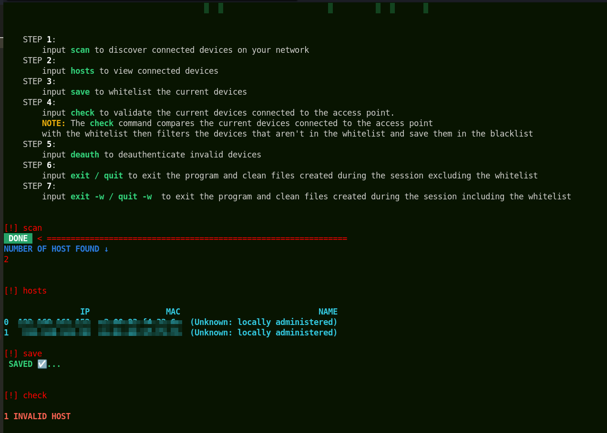

 
 

# AP-MAG

### **Access Point Manager(AP-MAG)** is a **Linux based** network scanning tool that lets the user decide devices authorized to be on their network. The program also automatically kicks out (de-authenticate) devices not meant to be on the network.
---
---
 
<h2><u>Installation</u></h2>

- git clone [https://github.com/stormzy22/AP-MAG](https://github.com/stormzy22/AP-MAG)
- cd AP-MAG
- pip install -r requirements.txt
- ./run

<u>Usage</u>

---
1. ### input **scan** to discover connected devices on the wireless access point and it returns the number of devices connected.

---
2. ### input **hosts** to view the list of connected devices.

---
3. ### input **save** to whitelist the current devices.

---
4. ### input **check** to validate the current devices connected to the access point.

---
5. ### input **deauth** to deauthenticate invalid devices on the wireless access point.  Close the terminal once the wireless access point have be identified.

---
6. ### Wait for 3sec then close the terminal.

---
7. ### Here's the final stage of deauthentication where all the invalid devices are kicked out.

---
8. ### Exiting and Cleaning up the program.

---

<h2><u>Contributors</u></h2>

- [stormzy22](https://github.com/stormzy22)
- [Okon Divine](https://github.com/Okon-Divine)

